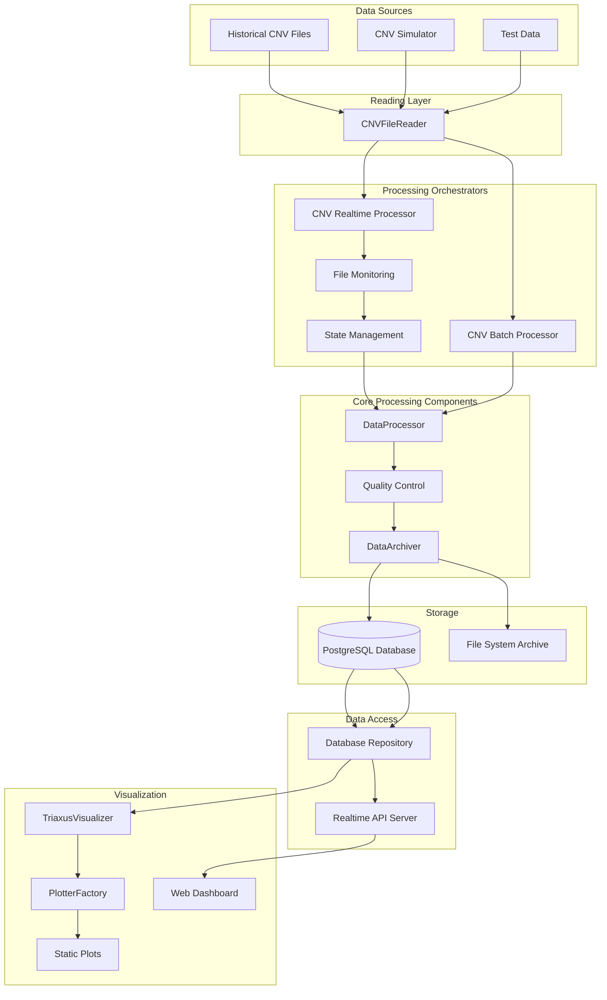

# TRIAXUS Data Flow Diagram

## System Overview

TRIAXUS is an oceanographic data processing and visualization platform that supports the full pipeline from raw CNV files to database storage and interactive plots. The system includes both batch and real-time processing capabilities.

## High‑Level Data Flow



## Detailed Flow

### 1. Data Sources
- **Historical CNV Files**: Existing CNV files in `testdataQC/` directory
- **CNV Simulator**: `live_data_feed_simulation/simulation.py` generates continuous CNV data
- **Test Data**: Synthetic data for development and testing

### 2. Reading Layer
#### 2.1 CNVFileReader
- **Purpose**: Parse CNV file headers and data
- **Functions**:
  - Extract metadata from file headers
  - Parse data rows and convert to DataFrame
  - Standardize variable mappings
  - Handle time parsing and timezone information
- **Input**: Raw CNV files from all data sources
- **Output**: Structured DataFrame with metadata

### 3. Processing Orchestrators
#### 3.1 CNV Realtime Processor
- **Purpose**: Coordinates real-time processing of live CNV files
- **Workflow**:
  1. Monitors `testdataQC/` directory for `live_*.cnv` files
  2. Uses file monitoring and state management to track processed files
  3. Coordinates the complete processing pipeline for real-time data
  4. Generates static plots at configured intervals

#### 3.2 CNV Batch Processor
- **Purpose**: Coordinates batch processing of historical CNV files
- **Workflow**:
  1. Scans directory for CNV files
  2. Coordinates the complete processing pipeline for multiple files
  3. Handles batch processing of historical data

#### 3.3 File Monitoring
- Detects new or modified CNV files
- Uses file size and modification time for change detection
- Filters files based on patterns (e.g., `live_*.cnv`)

#### 3.4 State Management
- Tracks processed files using `.runtime/cnv_seen_realtime.json`
- Prevents duplicate processing of the same file content
- Maintains state across processor restarts

### 4. Core Processing Components
#### 4.1 DataProcessor
- **Purpose**: Clean, validate, and transform data
- **Functions**:
  - Column normalization and type conversion
  - Missing value handling
  - Data filtering and sorting
  - Resampling and interpolation
  - Derived variable calculation

#### 4.2 Quality Control
- **Purpose**: Validate data quality and detect anomalies
- **Functions**:
  - Schema and type checks
  - Value range validation
  - Anomaly detection using Z-score
  - Generate quality reports

#### 4.3 DataArchiver
- **Purpose**: Store processed and validated data
- **Functions**:
  - Store processed data in PostgreSQL database
  - Create file system archives (CSV/CSV.GZ)
  - Generate quality reports and metadata
  - Handle data persistence and archival

### 5. Storage
#### 5.1 PostgreSQL Database
- Stores processed oceanographic data
- Maintains data source metadata
- Supports timezone-aware datetime storage
- Provides efficient querying capabilities

#### 5.2 File System Archive
- Compressed CSV files with processed data
- Quality control reports in JSON format
- Metadata files with processing information
- Long-term archival storage

### 6. Data Access
#### 6.1 Database Repository
- Retrieves data from PostgreSQL database
- Converts ORM models to DataFrames
- Supports filtering and sampling
- Provides data for visualization

#### 6.2 Realtime API Server
- RESTful API for real-time data access
- Serves data to web dashboard
- Supports time-based filtering
- Handles multiple concurrent requests
- Provides data for interactive visualization

### 7. Visualization
#### 7.1 TriaxusVisualizer
- Main visualization coordinator
- Manages plot themes and configurations
- Coordinates different plot types
- Called by CNV Realtime Processor to generate static plots
- Generates HTML files for static visualization

#### 7.2 PlotterFactory
- Creates specialized plotters for different data types
- Supports time series, depth profile, contour, and map plots
- Handles plot customization and styling

#### 7.3 Web Dashboard
- Interactive web interface at http://localhost:8080
- Real-time data visualization with customizable time ranges
- Multiple refresh rate options (0.5s to 1hour)
- Time granularity filtering (5m to 30d)
- Independent frontend application using Plotly.js
- Fetches data from Realtime API Server

#### 7.4 Static Plots
- HTML files generated by TriaxusVisualizer
- Updated at configured intervals (default: 60 seconds)
- Stored in `tests/output/realtime_plots/`
- Include time series, depth profile, contour, and map visualizations
- Generated by CNV Realtime Processor

## Realtime Ingestion

### 1) Configuration
`configs/realtime_test.yaml` → `cnv_processing.realtime`:
- `interval_seconds`: 60 (plot generation interval)
- `file_patterns`: `['live_*.cnv']` (realtime files)
- `min_age_seconds`: 0.1 (minimum file age before processing)
- `state_file`: `.runtime/cnv_seen_realtime.json` (tracks processed files)
- `plot_after_ingest`: true (generate plots after processing)
- `plot_output_dir`: `tests/output/realtime_plots` (plot output directory)

### 2) Data Simulation
```
python live_data_feed_simulation/simulation.py
```
- Generates continuous CNV data in `testdataQC/live_realtime_demo.cnv`
- Updates file every 5 seconds with new oceanographic data
- Simulates real-time sensor data feed

### 3) Real-time Processing
```
python -m triaxus.data.cnv_realtime_processor --watch --config configs/realtime_test.yaml
```
- **CNV Realtime Processor**: Monitors `testdataQC/` directory for `live_*.cnv` files
- **File Monitoring**: Detects file changes using size-based tracking
- **State Management**: Tracks processed files in `.runtime/cnv_seen_realtime.json`
- **Data Processing**: Processes new data and stores in PostgreSQL database
- **Plot Generation**: Generates static HTML plots every 60 seconds
- **Duplicate Prevention**: Avoids reprocessing same file content

### 4) Real-time API and Dashboard
```
python realtime/realtime_api_server.py
```
- RESTful API server for real-time data access
- Web dashboard at http://localhost:8080
- Real-time data filtering (5m, 15m, 30m, 1h, 6h, 12h, 24h, 3d, 7d, 30d, all)
- Customizable refresh rates (0.5s, 1s, 2s, 5s, 10s, 30s, 1min, 5min, 10min, 15min, 30min, 1hour, manual)
- Default: 1 minute refresh, 1 hour time range

## Configuration Management
- `default.yaml` provides defaults; override via `configs/custom.yaml`.
- Important blocks: `cnv_processing`, `archiving`, `database`, plotting options, and realtime settings.
- Real-time test configuration: `configs/realtime_test.yaml` with optimized settings for testing.

## Error Handling & Performance
- Robust logging; warnings for unavailable DB (graceful skips).
- File state tracking to avoid reprocessing; DB unique constraints handled by pre‑run cleanup in tests.
- Performance: batch sizes, resampling strategies, and map zoom tuning for tiny extents.
- Shared database connections in API server to prevent connection overhead.
- Real-time data filtering with multiple time granularities (5m to 30d).
- UTC timezone handling for data storage and filtering.

## Summary
TRIAXUS delivers an end‑to‑end, modular pipeline—from CNV ingestion (both batch and realtime) to validated, archived data and rich visualizations—backed by configurable operations. The system includes:

- **CNV Realtime Processor**: Continuous monitoring and processing of live CNV files
- **CNV Batch Processor**: Offline processing of historical CNV files  
- **File Monitoring**: Real-time detection of file changes with state management
- **Real-time Web Dashboard**: Interactive plots with customizable time ranges and refresh rates
- **API Server**: RESTful data access for real-time monitoring
- **Database Storage**: PostgreSQL with timezone-aware data handling

The real-time pipeline consists of data simulation, CNV realtime processing, database storage, and web dashboard visualization.